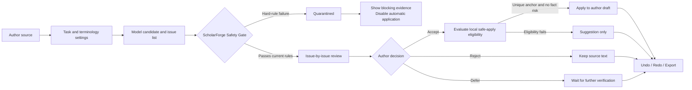
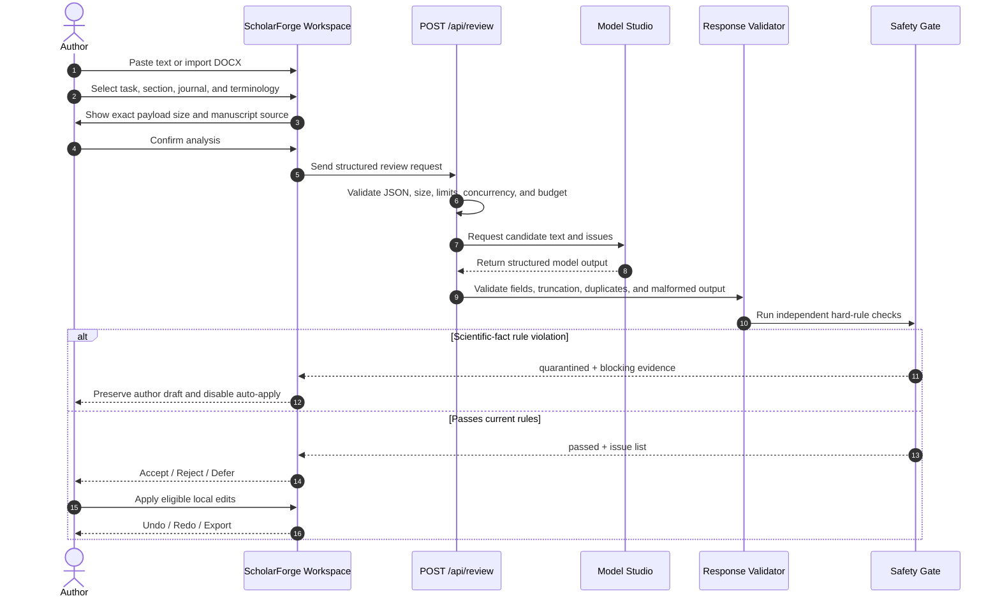
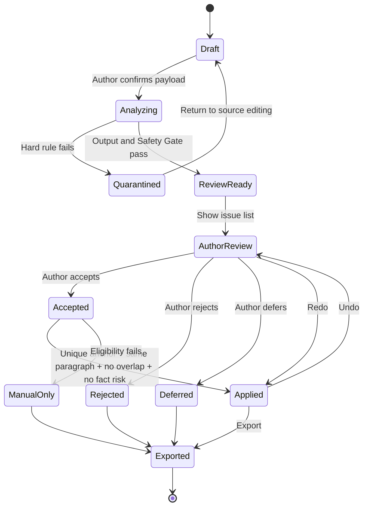
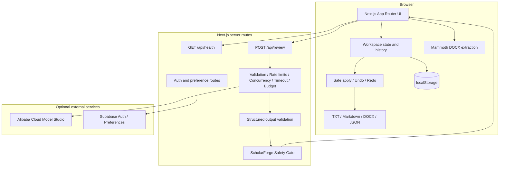
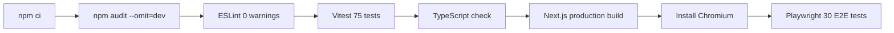
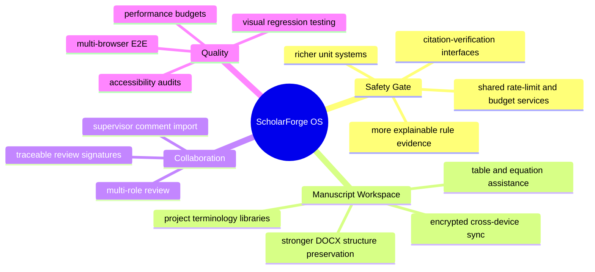

<div align="center">
  

  <h1>ScholarForge OS</h1>

  <p><strong>Scientific-fact safety workspace for AI-assisted manuscript review</strong></p>
  <p>The model proposes · Code verifies · The author decides</p>

  <p>
    <a href="https://scholarforge-os.vercel.app"><strong>Live Demo</strong></a>
    ·
    <a href="https://scholarforge-os.vercel.app/try">Quick Review</a>
    ·
    <a href="https://scholarforge-os.vercel.app/trust">Safety Rules</a>
    ·
    <a href="https://scholarforge-os.vercel.app/guide">User Guide</a>
    ·
    <a href="./README.md">简体中文</a>
  </p>

  <p>
    <a href="https://github.com/liqinglq666/scholarforge-os/actions/workflows/ci.yml">
      
    </a>
    
    
    
    
    
  </p>
</div>

> [!IMPORTANT]
> **Most AI writing tools help revise a manuscript. ScholarForge is designed to stop unsafe revisions from entering it.**  
> It places an independent **ScholarForge Safety Gate** between model-generated candidates and the author's working manuscript.

---

## Contents

- [Live experience](#live-experience)
- [Why ScholarForge](#why-scholarforge)
- [Trust model](#trust-model)
- [Core capabilities](#core-capabilities)
- [Review lifecycle](#review-lifecycle)
- [Safety Gate](#safety-gate)
- [Architecture](#architecture)
- [Project structure](#project-structure)
- [Quick start](#quick-start)
- [Environment variables](#environment-variables)
- [API contract](#api-contract)
- [Quality gates](#quality-gates)
- [Privacy and security](#privacy-and-security)
- [Known boundaries](#known-boundaries)
- [Roadmap](#roadmap)
- [Contributing and license](#contributing-and-license)

## Live experience

| Entry | URL | Best for |
| --- | --- | --- |
| **Product home** | [scholarforge-os.vercel.app](https://scholarforge-os.vercel.app) | Product positioning and capability overview |
| **Quick review** | [/try](https://scholarforge-os.vercel.app/try) | End-to-end review without signing in |
| **Professional workspace** | [/workspace](https://scholarforge-os.vercel.app/workspace) | Text input, DOCX import, and task configuration |
| **Safety Gate** | [/trust](https://scholarforge-os.vercel.app/trust) | Rule scope, risk boundaries, and validation model |
| **User guide** | [/guide](https://scholarforge-os.vercel.app/guide) | Product workflow and data-handling details |
| **Manuscript projects** | [/projects](https://scholarforge-os.vercel.app/projects) | Multi-project, multi-chapter, version, and feedback workflows |

> [!TIP]
> Start with **Quick Review**, load one of the public synthetic examples, then walk through task switching, pre-analysis confirmation, Safety Gate evidence, author decisions, safe application, undo/redo, and export.

## Why ScholarForge

Language models can improve grammar, clarity, and structure, but may silently change:

- values, percentages, sample sizes, or scientific notation;
- value-and-unit relationships;
- author-year citations, DOI strings, or protected terminology;
- experimental or methodological actions absent from the source;
- association versus causation;
- cautious versus definitive conclusions;
- a limited sample versus a universal population.

ScholarForge's central idea is simple: **the AI edit itself must become an object of review**.

```text
Conventional AI writing
source --> model rewrite --> copied into manuscript

ScholarForge OS
source --> model candidate --> Safety Gate --> author decision --> working draft
```

## Trust model

ScholarForge separates generation, verification, and decision-making into three independent permission layers.



### 1. The model only proposes

The model may generate candidate text, issue locations, explanations, and evidence. It cannot:

- overwrite the author draft;
- grant itself automatic-application permission;
- bypass application rules;
- accept a suggestion on behalf of the author.

### 2. Code independently verifies

After generation, application code re-checks values, units, citations, terminology, experimental claims, and scientific claim boundaries. A hard-rule failure becomes `quarantined`, not an opaque success response.

### 3. The author controls the final text

Even a candidate that passes current rules must be reviewed issue by issue. A local edit can be applied only when it has a unique text anchor and satisfies all hard safety conditions.

## Core capabilities

### Three scientific-writing tasks

| Task | Goal | Hard boundary |
| --- | --- | --- |
| **Scientific Chinese-to-English** | Produce reviewable academic English from Chinese scientific text | Preserve values, units, terminology, citations, and claim strength |
| **Conservative English polishing** | Improve grammar, syntax, cohesion, concision, and academic expression | Do not add facts, experiments, citations, or stronger conclusions |
| **Pre-submission check** | Identify language, reporting, logic, and evidence-boundary risks | No acceptance prediction, no peer-review replacement, no claim of scientific validation |

### Explicit source modes

The workspace records manuscript provenance rather than guessing it from text equality:

- `Public synthetic example`: task switching replaces the complete example package;
- `My text`: task switching changes only the task type and preserves the manuscript;
- `DOCX import`: extraction happens in the browser and task switching preserves the selected section.

The first author edit to an example moves the draft into **My text** mode and protects it from later example replacement.

### Full manuscript workflow

- multiple manuscript projects and chapters;
- abstract, methods, results, and discussion-level review;
- target-journal context and project terminology rules;
- cross-chapter value, sample-size, and terminology consistency checks;
- supervisor feedback tracking and author response notes;
- version comparison, history, and non-destructive recovery;
- TXT, Markdown, clean DOCX, and JSON workspace exports.

## Review lifecycle



## Safety Gate

### Current rule scope

| Domain | Examples |
| --- | --- |
| **Numbers** | integers, negatives, decimals, percentages, scientific notation, thousand separators, sample-size candidates |
| **Units** | supported value-unit combinations such as MPa, kPa, mg/L, °C, and time |
| **Citations** | author-year citations, DOI strings, citation placeholders |
| **Terminology** | material names, scales, algorithms, abbreviations, author-locked wording |
| **Experimental claims** | experiments, methods, or data sources absent from the original text |
| **Causality** | associated / correlated / predicted → caused / led to |
| **Certainty** | may / suggest / indicate → prove / confirm / completely |
| **Research scope** | limited or single-center sample → universal population claims |

### Safe-application state machine



> [!WARNING]
> Passing the Safety Gate means only that the candidate was not blocked by the current code rules. It does **not** establish scientific correctness, statistical validity, or submission readiness.

## Architecture



### Technology stack

| Layer | Technology |
| --- | --- |
| Web framework | Next.js 16 App Router |
| UI runtime | React 19 |
| Type system | TypeScript strict |
| DOCX import | Mammoth |
| DOCX export | `docx` |
| Unit and component tests | Vitest + Testing Library |
| Browser automation | Playwright |
| Model interface | Alibaba Cloud Model Studio / OpenAI-compatible Chat Completions |
| Optional account layer | Supabase Auth + preference sync |
| Deployment | Vercel |
| CI | GitHub Actions |

## Project structure

```text
scholarforge-os/
├── app/                         # App Router pages, API routes, and global styles
│   ├── api/                     # review / health / auth / preferences
│   ├── projects/                # manuscript projects and project-level routes
│   ├── workspace/               # quick-review workspace
│   ├── trust/                   # Safety Gate rules and boundaries
│   └── guide/                   # user guide
├── components/                  # workspace, review, feedback, and shared UI
├── lib/                         # domain logic, validation, storage, import/export
│   ├── documents/               # DOCX import and export
│   ├── review/                  # Safety Gate and review rules
│   └── ...
├── tests/                       # Vitest unit, API, and component tests
├── e2e/                         # Playwright desktop and mobile scenarios
├── supabase/migrations/         # optional preference-sync migration
├── .github/workflows/ci.yml     # complete quality gate
├── .env.example
└── package.json
```

## Quick start

### Requirements

- Node.js `22.x`
- npm with the committed lockfile

### Local development

```bash
git clone https://github.com/liqinglq666/scholarforge-os.git
cd scholarforge-os
npm ci
cp .env.example .env.local
npm run dev
```

Open:

```text
http://localhost:3000
```

Without model configuration, the app remains usable for browsing, editing, project management, DOCX extraction, and local safety demonstrations. Live analysis is explicitly disabled and no fake result is generated.

## Environment variables

```dotenv
# Required for live model review. Server-side only.
DASHSCOPE_API_KEY=

# Optional OpenAI-compatible Model Studio endpoint and model.
DASHSCOPE_BASE_URL=https://dashscope.aliyuncs.com/compatible-mode/v1
DASHSCOPE_MODEL=qwen-plus

# Optional daily request-count circuit breaker. 0 disables it.
REVIEW_DAILY_REQUEST_BUDGET=0

# Optional account and personalization preference sync.
SUPABASE_URL=
SUPABASE_PUBLISHABLE_KEY=
```

> [!CAUTION]
> `DASHSCOPE_API_KEY` must remain server-side. Never add a `NEXT_PUBLIC_` prefix and never commit the key to Git.

Before enabling Supabase preference sync, run:

```text
supabase/migrations/202608020001_user_preferences.sql
```

## API contract

### Health check

```http
GET /api/health
```

### Start a review

```http
POST /api/review
Content-Type: application/json
```

Example request:

```json
{
  "taskId": "review-2026-001",
  "taskType": "polish",
  "sectionType": "results",
  "sourceText": "The compressive strength increased from 42.5 MPa to 51.3 MPa...",
  "targetJournal": "Construction and Building Materials",
  "terminologyLocks": [
    {
      "id": "term-1",
      "source": "pore structure",
      "preferred": "pore structure"
    }
  ]
}
```

The response combines model output with independently computed Safety Gate evidence. Conceptual shape:

```json
{
  "requestId": "req_xxx",
  "result": {
    "summary": "Issues requiring author review were found.",
    "suggestedText": "...",
    "issues": [
      {
        "id": "issue-1",
        "original": "can prove",
        "revised": "indicate",
        "reason": "Avoid upgrading the evidence boundary to definitive proof.",
        "safeToApply": true
      }
    ],
    "safetyGate": {
      "status": "passed",
      "blockedCount": 0,
      "reviewCount": 1,
      "checks": []
    }
  }
}
```

The repository's TypeScript types and runtime validators are authoritative. Clients must not trust or fabricate `safeToApply`.

## Commands

```bash
npm run dev          # local development
npm run lint         # ESLint, zero warnings allowed
npm run test         # Vitest unit / API / component tests
npm run test:watch   # test watch mode
npm run typecheck    # Next.js type generation + tsc --noEmit
npm run build        # Next.js production build
npm run start        # start the production build
npm run test:e2e     # Playwright E2E
```

## Quality gates

Every push and pull request runs the complete CI pipeline:



Coverage includes:

- request and model-output validation;
- values, units, citations, terminology, and experimental claims;
- causality, certainty, and research-scope boundaries;
- model-declared safety rejected by independent code;
- quarantined results and safe-apply permissions;
- unique anchors, overlap checks, undo, and redo;
- example, custom-text, and DOCX source modes;
- multi-project workflows, cross-chapter consistency, feedback, and versions;
- backup import, recovery, and tamper resistance;
- desktop and mobile core flows;
- horizontal-overflow and minimum-typography regression checks.

## Deploying to Vercel

1. Fork or import this repository.
2. Select the `Next.js` framework preset.
3. Set Node.js to `22.x`.
4. Configure server-side environment variables.
5. Deploy to production.
6. Check `/api/health` after deployment.

Production deployments should also add:

- platform WAF and rate limiting;
- model-provider budget alerts;
- shared atomic rate-limit storage;
- error monitoring and privacy review;
- a custom domain and explicit data-processing policy.

## Privacy and security

- Manuscripts, chapters, feedback, full version text, analysis history, and author decisions are stored in browser `localStorage` by default.
- DOCX extraction happens in the browser; the original binary is not uploaded.
- Text and settings are sent only after explicit author confirmation.
- Signing in does not automatically upload manuscript text, feedback, full versions, or analysis history.
- Optional Supabase accounts synchronize validated personalization preferences only.
- When the model is unavailable, the API returns an explicit error and never fabricates analysis.
- JSON backup recovery is non-destructive; stored edit offsets are never trusted blindly.
- The application does not log full manuscript bodies, API keys, or complete model responses.

### Public endpoint protections

- browser-session request limits;
- egress-IP request limits;
- per-instance concurrency limits;
- request-body and character limits;
- model timeout and output limits;
- optional daily request-budget circuit breaker;
- `Retry-After` on `429` responses.

The current limiter is in-memory per instance. Multi-instance public deployments should replace it with shared atomic storage.

## Known boundaries

ScholarForge does **not**:

- verify the authenticity of source data;
- determine whether statistical analysis is correct;
- confirm that cited literature supports a claim;
- replace supervisors, statisticians, ethics review, peer review, or journal editors;
- fully preserve complex DOCX equations, tables, footnotes, comments, tracked changes, and layout;
- guarantee that either rules or models have no false positives or false negatives;
- turn a Safety Gate pass into proof of scientific correctness.

A clean DOCX export is a newly generated editing copy, not an in-place modification of the original file.

## Roadmap



The roadmap communicates direction only; it does not represent implemented features or promised release dates.

## Contributing and license

Contributions are welcome for:

- reproducible safety-rule failures;
- scientific-writing boundary test cases;
- accessibility, mobile, and interaction improvements;
- DOCX import/export compatibility fixes;
- Chinese and English documentation improvements.

Suggested contribution flow:

```bash
git checkout -b feat/your-change
npm ci
npm run lint
npm run test
npm run typecheck
npm run build
npm run test:e2e
```

> [!NOTE]
> The repository currently does not contain a standalone open-source license. Until a license is added, do not assume the code may be freely copied, redistributed, or used commercially.

ScholarForge OS provides author-assistance tooling only. Its output is not a guarantee of submission, publication, statistical validity, ethical compliance, medical correctness, or legal compliance. The author remains responsible for scientific facts, citations, statistics, and final text.

---

<div align="center">
  <strong>ScholarForge OS</strong><br />
  Stop unsafe AI edits before they enter scientific manuscripts.
</div>
