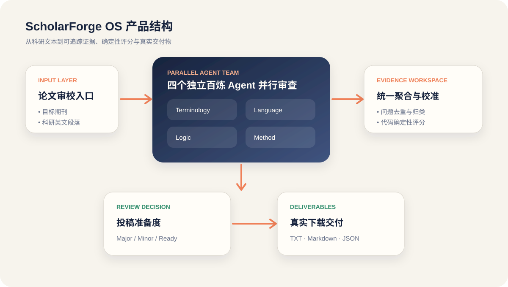
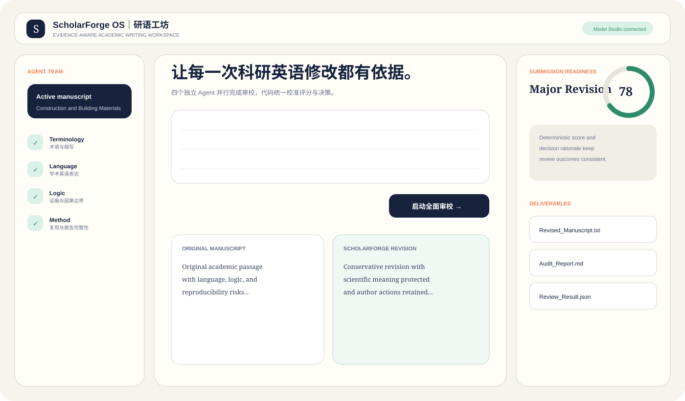
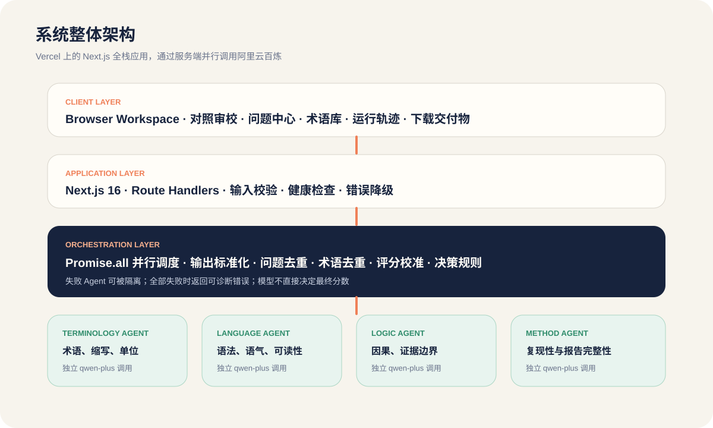
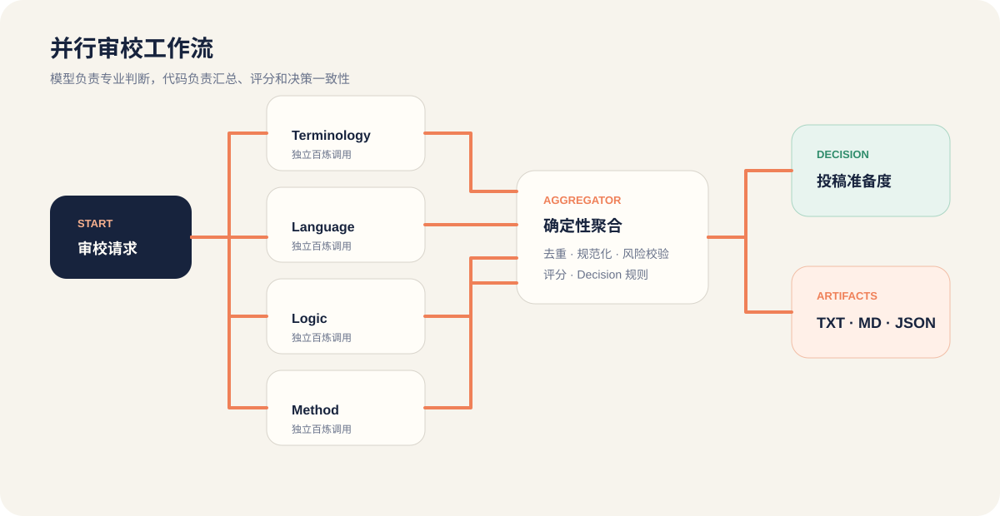

# ScholarForge OS

[简体中文](README.md) | [English](README.en.md)

<p align="center">
  
</p>

<p align="center">
  A multi-agent academic English review and submission-readiness workspace for researchers
</p>

<p align="center">
  <a href="https://scholarforge-os.vercel.app">Live Demo</a> ·
  <a href="docs/product.md">Product Documentation</a> ·
  <a href="docs/technical.md">Technical Documentation</a> ·
  <a href="docs/PRD.md">PRD</a>
</p>

## One-line introduction

ScholarForge OS runs four independent Model Studio agents in parallel to audit terminology, academic language, scientific logic, and method reporting, then uses deterministic code to aggregate issues, calibrate the score, produce a reviewer decision, and generate downloadable artifacts.

## What problem does it solve?

Many academic writing tools improve fluency but fail to support real manuscript work. Their edits are difficult to explain, terminology drifts across revisions, causal claims may exceed the evidence, missing experimental information may be fabricated, and model-generated scores can conflict with the final decision.

ScholarForge OS is not another polishing textbox. It connects specialist review, evidence localization, scientific guardrails, execution tracing, deterministic scoring, and deliverable generation into one workflow.

It focuses on five recurring risks:

- Unnatural academic English
- Inconsistent terminology, abbreviations, units, and nomenclature
- Claims or causality that exceed the evidence shown
- Missing reproducibility information
- Review results that cannot be traced, audited, or exported

## Product architecture



The product consists of:

- **Review Input** — target journal and manuscript passage
- **Parallel Agent Team** — four independent Alibaba Cloud Model Studio calls
- **Evidence Aggregator** — normalization, de-duplication, guardrails, scoring, and decision rules
- **Review Workspace** — comparison, issues, terminology, and execution trace
- **Submission Readiness** — deterministic score, reviewer decision, and rationale
- **Deliverables** — revised text, Markdown report, and structured JSON

The central principle is: **models provide specialist judgment; code owns the final rules.**

## Core workflow

1. Enter a target journal and paste an academic passage.
2. Start the full review.
3. Terminology Guardian audits terminology, abbreviations, units, and naming.
4. Academic Editor creates a conservative full revision.
5. Logic Auditor checks causality, evidence boundaries, and overstatement.
6. Method Auditor checks reproducibility and reporting completeness.
7. The aggregator normalizes and de-duplicates issues, applies guardrails, and calculates the score.
8. Review the comparison, issue center, terminology glossary, and real execution trace.
9. Download the revised text, Markdown report, or JSON evidence data.

## Workspace



The interface uses a three-column workspace:

- Left: project context, agent team, and scientific guardrails
- Center: input, comparison, issues, terminology, and execution trace
- Right: submission readiness, decision rationale, metrics, and artifacts

## Real multi-agent execution

Version 0.2 no longer simulates multiple roles inside one prompt. It performs four independent model requests:

```text
Terminology Agent ─┐
Language Agent ────┼──→ Deterministic Aggregator
Logic Agent ───────┤
Method Agent ──────┘
```

The requests run concurrently with `Promise.all`. Every agent has an independent system prompt, response, duration, and failure state.

A failed agent is isolated and successful outputs are still retained. The workflow fails only when all four specialists fail.

## Scientific guardrails

ScholarForge OS prioritizes scientific meaning over stylistic fluency:

- Never fabricate experiments, sample counts, equipment settings, standards, or references
- Never introduce numerical values absent from the source passage
- Keep missing information visible as `[Please provide ...]` author actions
- Do not disguise scientific claim changes as language editing
- Do not let a model directly determine the final score or reviewer decision
- Do not erase major logic or method problems simply because the English is smoother

## Technical architecture



The current implementation is a lightweight Next.js full-stack application:

- **Client Layer** — three-column workspace and browser-side exports
- **Application Layer** — Next.js Route Handlers, validation, health checks, and error boundaries
- **Orchestration Layer** — parallel scheduling, normalization, de-duplication, scoring, and decision rules
- **Agent Layer** — four independent `qwen-plus` calls through Alibaba Cloud Model Studio
- **Artifact Layer** — TXT, Markdown, and JSON downloads

### Parallel runtime



### Deterministic score and decision

Models identify issues but do not supply the final score. The application applies fixed severity weights and reviewer-decision thresholds.

- `Major Revision`: score after revision is below 80, or at least two major logic/method issues remain
- `Minor Revision`: score is below 92, or any major issue remains
- `Ready for Submission`: score is at least 92 and no major issue remains

## Current deliverables

- `Revised_Manuscript.txt`
- `Audit_Report.md`
- `Review_Result.json`

DOCX Track Changes, PDF reports, and response-to-reviewers documents are planned for later versions.

## Technology stack

| Layer | Technology |
| --- | --- |
| Frontend | Next.js 16, React 19, TypeScript, native CSS |
| Server | Next.js Route Handlers, Node.js runtime |
| Model platform | Alibaba Cloud Model Studio OpenAI-compatible API |
| Default model | `qwen-plus` |
| Multi-agent scheduling | Parallel `Promise.all` execution |
| File export | Browser Blob and Object URL |
| Deployment | Vercel |
| CI | GitHub Actions, Node.js 22 |

## Repository structure

```text
.
├── app/
│   ├── api/health/route.ts
│   ├── api/review/route.ts
│   ├── globals.css
│   ├── v02.css
│   ├── layout.tsx
│   └── page.tsx
├── lib/
│   ├── bailian.ts
│   ├── demo-review.ts
│   └── types.ts
├── public/
│   └── scholarforge-mark.svg
├── docs/
│   ├── PRD.md
│   ├── product.md
│   ├── technical.md
│   └── readme-assets/
├── .github/workflows/ci.yml
├── .env.example
├── package.json
└── README.md
```

## Quick start

### Requirements

- Node.js 20.9+
- Node.js 22 recommended
- npm
- Model Studio API key, optional; the application falls back to demo mode without a key

### Clone and install

```bash
git clone git@github.com:liqinglq666/scholarforge-os.git
cd scholarforge-os
npm install
```

### Configure environment variables

```bash
cp .env.example .env.local
```

```env
DASHSCOPE_API_KEY=your_api_key
DASHSCOPE_BASE_URL=https://dashscope.aliyuncs.com/compatible-mode/v1
DASHSCOPE_MODEL=qwen-plus
```

Do not use `NEXT_PUBLIC_DASHSCOPE_API_KEY`; it would expose the key to the browser.

### Run locally

```bash
npm run dev
```

- Web: `http://localhost:3000`
- Health check: `http://localhost:3000/api/health`

### Validate

```bash
npm run typecheck
npm run build
```

## Vercel deployment

1. Import `liqinglq666/scholarforge-os` from GitHub.
2. Keep the Next.js preset and root directory `./`.
3. Add `DASHSCOPE_API_KEY`, `DASHSCOPE_BASE_URL`, and `DASHSCOPE_MODEL`.
4. Deploy.
5. Open `/api/health` and verify `modelStudioConfigured: true`.
6. Run one live review from the workspace.

## Documentation

- [Product Requirements Document](docs/PRD.md)
- [Product Documentation](docs/product.md)
- [Technical Documentation](docs/technical.md)

## Current boundaries

- Plain-text input only; no PDF or DOCX parsing yet
- No user accounts, database, or persistent cloud manuscript projects
- No accept/reject workflow for individual edits
- Only Academic Editor produces the full conservative revision
- Logic and method actions remain visible in the issue center instead of being fabricated into the manuscript
- Numeric protection is token-level, not complete factual verification
- Multi-agent execution is still bounded by one Vercel function lifecycle
- The score is a product decision aid, not an official journal evaluation
- In live mode, the submitted text is sent to Alibaba Cloud Model Studio

## Roadmap

### v0.3 — document and project workspace

- PDF/DOCX upload
- Section parsing
- Manuscript version history
- Terminology memory
- Accept or reject individual edits

### v0.4 — submission workflow

- Response to Reviewers
- Cover Letter
- Highlights
- Author Contributions
- Data Availability Statement

### v0.5 — evidence chain

- Journal-guideline knowledge base
- Citation and DOI verification
- Cross-section consistency review
- DOCX Track Changes export

## License

No open-source license has been added. Copying, modification, or commercial use is not granted by default.
