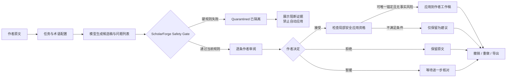
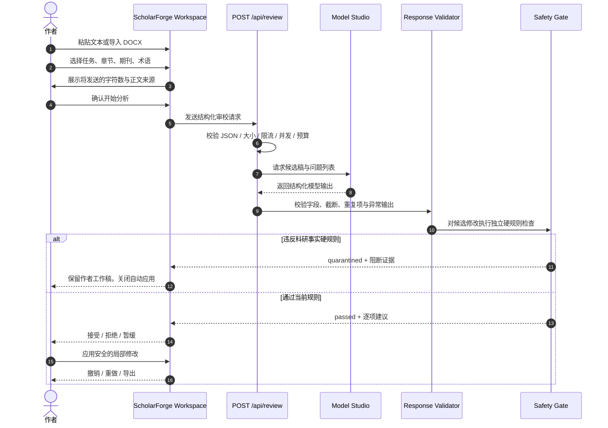
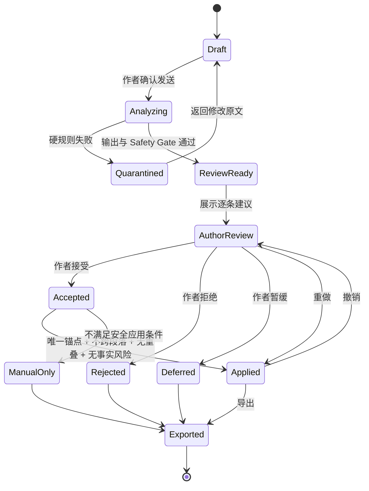
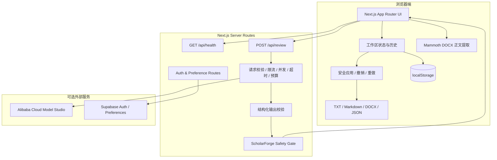
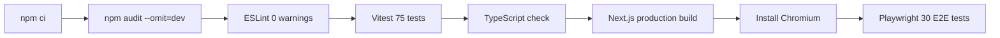
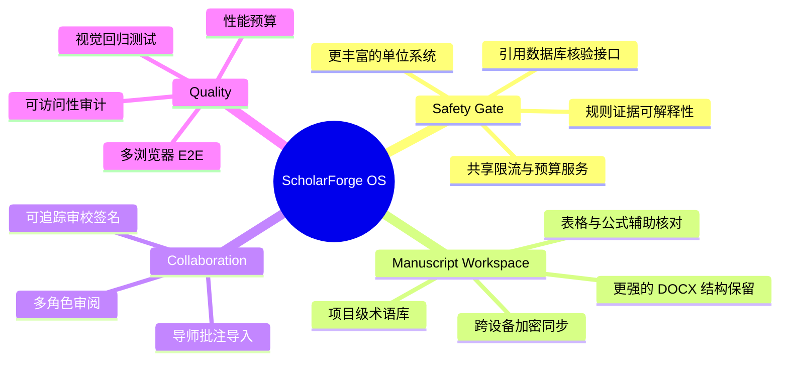

<div align="center">
  

  <h1>ScholarForge OS｜研语工坊</h1>

  <p><strong>科研事实安全审校工作台</strong></p>
  <p>模型提出 · 代码核验 · 作者决定</p>

  <p>
    <a href="https://scholarforge-os.vercel.app"><strong>在线体验</strong></a>
    ·
    <a href="https://scholarforge-os.vercel.app/try">快速评审</a>
    ·
    <a href="https://scholarforge-os.vercel.app/trust">安全规则</a>
    ·
    <a href="https://scholarforge-os.vercel.app/guide">使用手册</a>
    ·
    <a href="./README.en.md">English</a>
  </p>

  <p>
    <a href="https://github.com/liqinglq666/scholarforge-os/actions/workflows/ci.yml">
      
    </a>
    
    
    
    
    
  </p>
</div>

> [!IMPORTANT]
> **普通 AI 帮助修改论文，ScholarForge 负责阻止 AI 改错论文。**  
> ScholarForge 不把模型输出直接覆盖到作者文本，而是在 AI 候选稿与作者工作稿之间加入独立的 **ScholarForge Safety Gate｜科研事实安全门**。

---

## 目录

- [在线体验](#在线体验)
- [为什么需要 ScholarForge](#为什么需要-scholarforge)
- [可信审校模型](#可信审校模型)
- [核心能力](#核心能力)
- [产品工作流](#产品工作流)
- [Safety Gate](#safety-gate)
- [技术架构](#技术架构)
- [项目结构](#项目结构)
- [快速开始](#快速开始)
- [环境变量](#环境变量)
- [API 契约](#api-契约)
- [质量保障](#质量保障)
- [数据隐私与安全](#数据隐私与安全)
- [已知边界](#已知边界)
- [路线图](#路线图)
- [贡献与许可](#贡献与许可)

## 在线体验

| 入口 | 地址 | 适合场景 |
| --- | --- | --- |
| **产品首页** | [scholarforge-os.vercel.app](https://scholarforge-os.vercel.app) | 了解产品定位与核心能力 |
| **快速评审** | [/try](https://scholarforge-os.vercel.app/try) | 无需登录，体验完整审校流程 |
| **专业工作台** | [/workspace](https://scholarforge-os.vercel.app/workspace) | 输入文本、导入 DOCX、配置任务 |
| **Safety Gate** | [/trust](https://scholarforge-os.vercel.app/trust) | 查看规则范围、风险边界和测试说明 |
| **使用手册** | [/guide](https://scholarforge-os.vercel.app/guide) | 查看操作流程与数据说明 |
| **论文项目** | [/projects](https://scholarforge-os.vercel.app/projects) | 管理多论文、多章节、版本与导师意见 |

> [!TIP]
> 推荐先打开 **快速评审**，选择任一公开合成示例，再依次体验：任务切换 → 分析前确认 → Safety Gate → 作者决策 → 安全应用 → 撤销/重做 → 导出。

## 为什么需要 ScholarForge

科研写作模型可以改善语法、表达和结构，但也可能在“润色”过程中静默改变：

- 数值、百分数、样本量和科学计数法；
- 数值与单位的对应关系；
- 作者—年份引用、DOI 或受保护术语；
- 原文没有提供的实验步骤或方法声明；
- 相关关系与因果关系；
- 审慎结论与确定性结论；
- 有限样本与普遍人群之间的研究范围。

ScholarForge 的核心创新不是让模型写得更多，而是让 **AI 修改本身成为被审查的对象**。

```text
传统 AI 写作工具
原文 ──> 模型改写 ──> 直接复制到论文

ScholarForge OS
原文 ──> 模型候选 ──> Safety Gate ──> 作者逐条决定 ──> 工作稿
```

## 可信审校模型

ScholarForge 使用三层权限模型，把“生成、校验、决策”拆分为彼此独立的责任边界。



### 1. 模型只提出候选

模型生成候选文本、问题位置、修改理由和证据，但无权：

- 覆盖作者工作稿；
- 宣布自己生成的内容“安全”；
- 绕过代码规则；
- 代替作者接受建议。

### 2. 代码独立执行安全门

模型返回后，应用代码重新检查数字、单位、引用、术语、实验声明和科研主张边界。失败结果会进入 `quarantined`，而不是伪装成普通成功。

### 3. 作者控制最终文本

即使候选稿通过当前规则，作者仍需逐条接受、拒绝或暂缓。只有具备唯一文本锚点且满足硬规则的局部建议，才可能应用到工作稿。

## 核心能力

### 三种科研任务

| 任务 | 目标 | 不可突破的边界 |
| --- | --- | --- |
| **科研中译英** | 将中文科研段落转换为可核对的学术英文 | 不改变数值、单位、术语、引用和证据强度 |
| **英文保守润色** | 改善语法、句法、连贯性、简洁性与学术表达 | 不新增事实、实验、引用或更强结论 |
| **投稿前检查** | 识别语言、方法报告、逻辑与证据边界风险 | 不预测录用，不替代同行评议，不声称验证科学正确性 |

### 明确的正文来源模式

工作台不会通过“猜测文本内容”判断当前状态，而是明确展示来源：

- `公开合成示例`：切换任务时同步更换整套示例；
- `我的文本`：切换任务只改变任务类型，不覆盖正文；
- `DOCX 导入`：原始文件在浏览器解析，切换任务不覆盖所选章节。

用户首次修改公开示例后，系统会自动进入“我的文本”模式，并保护后续内容不被任务切换覆盖。

### 完整论文工作流

- 多论文项目与多章节管理；
- 摘要、方法、结果、讨论等章节级审校；
- 目标期刊语境和项目术语规则；
- 跨章节数值、样本量和术语一致性检查；
- 导师意见拆分、处理状态与作者回复；
- 版本比较、历史记录与非破坏性恢复；
- TXT、Markdown、清洁 DOCX 和 JSON 工作区备份导出。

## 产品工作流



## Safety Gate

### 当前检查范围

| 检查域 | 示例 |
| --- | --- |
| **数字** | 整数、负数、小数、百分数、科学计数法、千位分隔符、样本量候选 |
| **单位** | MPa、kPa、mg/L、°C、时间等受支持的数值—单位组合 |
| **引用** | 作者—年份引用、DOI、引用占位符 |
| **术语** | 材料名、量表、算法、缩写、作者锁定译法 |
| **实验声明** | 原文未出现的新实验、新方法或新数据来源 |
| **因果关系** | associated / correlated / predicted → caused / led to |
| **结论强度** | may / suggest / indicate → prove / confirm / completely |
| **研究范围** | 特定样本或单中心研究 → 所有人群或普遍适用 |

### 安全应用状态机



> [!WARNING]
> Safety Gate 通过只表示“未被当前代码规则阻断”，**不等于科学正确、统计正确或可直接投稿**。规则与模型都可能出现漏报或误报。

## 技术架构



### 技术栈

| 层级 | 技术 |
| --- | --- |
| Web 框架 | Next.js 16 App Router |
| UI 运行时 | React 19 |
| 类型系统 | TypeScript strict |
| DOCX 导入 | Mammoth |
| DOCX 导出 | `docx` |
| 单元与组件测试 | Vitest + Testing Library |
| 浏览器自动化 | Playwright |
| 模型接口 | 阿里云百炼 / OpenAI-compatible Chat Completions |
| 可选账户 | Supabase Auth + 用户偏好同步 |
| 部署 | Vercel |
| CI | GitHub Actions |

## 项目结构

```text
scholarforge-os/
├── app/                         # App Router 页面、API 路由与全局样式
│   ├── api/                     # review / health / auth / preferences
│   ├── projects/                # 多论文项目及项目级子路由
│   ├── workspace/               # 快速审校工作台
│   ├── trust/                   # Safety Gate 规则与边界
│   └── guide/                   # 使用手册
├── components/                  # 工作台、审校、反馈与通用 UI
├── lib/                         # 领域逻辑、校验、存储、导入导出
│   ├── documents/               # DOCX 导入导出
│   ├── review/                  # Safety Gate 与审校规则
│   └── ...
├── tests/                       # Vitest 单元、API 与组件测试
├── e2e/                         # Playwright 桌面端与移动端场景
├── supabase/migrations/         # 可选偏好同步数据库迁移
├── .github/workflows/ci.yml     # 完整质量门
├── .env.example
└── package.json
```

## 快速开始

### 环境要求

- Node.js `22.x`
- npm（建议使用仓库锁定版本安装依赖）

### 本地运行

```bash
git clone https://github.com/liqinglq666/scholarforge-os.git
cd scholarforge-os
npm ci
cp .env.example .env.local
npm run dev
```

打开：

```text
http://localhost:3000
```

模型未配置时，页面仍可用于浏览、编辑、项目管理、DOCX 解析和本地规则体验；真实分析按钮会明确禁用，不会生成伪造结果。

## 环境变量

```dotenv
# 必填：真实模型分析，仅在服务端读取
DASHSCOPE_API_KEY=

# 可选：阿里云百炼 OpenAI-compatible 地址与模型
DASHSCOPE_BASE_URL=https://dashscope.aliyuncs.com/compatible-mode/v1
DASHSCOPE_MODEL=qwen-plus

# 可选：每日请求预算熔断；0 表示关闭应用级预算
REVIEW_DAILY_REQUEST_BUDGET=0

# 可选：账户与个性化偏好同步
SUPABASE_URL=
SUPABASE_PUBLISHABLE_KEY=
```

> [!CAUTION]
> `DASHSCOPE_API_KEY` 必须保持为服务端环境变量，不得添加 `NEXT_PUBLIC_` 前缀，也不得提交到 Git。

启用 Supabase 偏好同步前，需要执行：

```text
supabase/migrations/202608020001_user_preferences.sql
```

## API 契约

### 健康检查

```http
GET /api/health
```

### 发起审校

```http
POST /api/review
Content-Type: application/json
```

请求示例：

```json
{
  "taskId": "review-2026-001",
  "taskType": "polish",
  "sectionType": "results",
  "sourceText": "The compressive strength increased from 42.5 MPa to 51.3 MPa...",
  "targetJournal": "Construction and Building Materials",
  "terminologyLocks": [
    {
      "id": "term-1",
      "source": "pore structure",
      "preferred": "pore structure"
    }
  ]
}
```

响应由模型结果与代码独立计算的 Safety Gate 信息共同组成。概念结构如下：

```json
{
  "requestId": "req_xxx",
  "result": {
    "summary": "发现需要作者核对的表达与证据边界问题。",
    "suggestedText": "...",
    "issues": [
      {
        "id": "issue-1",
        "original": "can prove",
        "revised": "indicate",
        "reason": "避免把证据强度升级为确定性证明。",
        "safeToApply": true
      }
    ],
    "safetyGate": {
      "status": "passed",
      "blockedCount": 0,
      "reviewCount": 1,
      "checks": []
    }
  }
}
```

> API 的实际字段以仓库 TypeScript 类型和运行时校验为准。客户端不得自行信任或伪造 `safeToApply`。

## 常用命令

```bash
npm run dev          # 本地开发
npm run lint         # ESLint，禁止警告
npm run test         # Vitest 单元 / API / 组件测试
npm run test:watch   # 测试监听模式
npm run typecheck    # Next.js 类型生成 + tsc --noEmit
npm run build        # Next.js 生产构建
npm run start        # 启动生产构建
npm run test:e2e     # Playwright E2E
```

## 质量保障

当前 CI 在每次推送与 Pull Request 上执行完整质量门：



自动化覆盖包括：

- 请求与模型输出结构校验；
- 数字、单位、引用、术语和实验声明；
- 因果关系、结论强度和研究范围；
- 模型自称安全但被代码拒绝；
- 隔离结果与安全应用权限；
- 唯一文本锚点、重叠检查、撤销与重做；
- 示例模式、我的文本模式和 DOCX 模式；
- 多项目、跨章节一致性、导师意见与版本比较；
- 备份导入、恢复与篡改数据防护；
- 桌面端和移动端核心流程；
- 页面横向溢出与关键字号回归。

## 部署到 Vercel

1. Fork 或导入本仓库；
2. Framework Preset 选择 `Next.js`；
3. Node.js 版本设置为 `22.x`；
4. 配置服务端环境变量；
5. 执行生产部署；
6. 部署后访问 `/api/health` 检查模型配置状态。

生产建议同时配置：

- 平台 WAF 与速率限制；
- 模型供应商预算告警；
- 共享原子限流存储；
- 错误监控与隐私审计；
- 自定义域名和明确的数据处理政策。

## 数据隐私与安全

- 论文项目、章节、导师意见、版本全文、分析历史和作者决定默认保存在当前浏览器 `localStorage`；
- DOCX 在浏览器中提取正文，原始二进制文件不会上传；
- 只有用户明确确认开始分析后，当前文本和设置才会发送到服务端与模型；
- 登录不会自动上传论文正文、导师意见、版本全文或分析历史；
- 可选 Supabase 账户只同步经过验证的个性化偏好；
- 模型未配置时，API 返回明确错误，不生成演示或伪造分析；
- 完整 JSON 备份采用非破坏性恢复，历史编辑偏移不会被直接信任；
- 应用不会在日志中记录完整论文正文、API Key 或完整模型响应。

### 公开接口保护

- 浏览器会话级请求限制；
- 出口 IP 级请求限制；
- 单实例并发限制；
- 请求体与字符数限制；
- 模型超时与输出长度限制；
- 可配置每日请求预算熔断；
- `429` 响应包含 `Retry-After`。

当前限流计数器为单实例内存实现。多实例公开部署应替换为共享原子存储。

## 已知边界

ScholarForge **不能**：

- 验证原始数据真实性；
- 判断统计分析是否正确；
- 核实参考文献内容是否支持主张；
- 替代导师、统计专家、伦理审查、同行评议或期刊编辑；
- 完整保留复杂 DOCX 的公式、表格、脚注、批注、修订痕迹和原始排版；
- 保证模型或规则不存在漏报与误报；
- 将 Safety Gate 通过解释为“论文已经科学正确”。

清洁 DOCX 是重新生成的编辑副本，不是对原文件进行原位修改。

## 路线图



路线图表示规划方向，不代表已经实现或承诺发布时间。

## 贡献与许可

欢迎通过 Issue 或 Pull Request 提交：

- 可复现的安全规则问题；
- 科研文本边界测试案例；
- 无障碍、移动端和交互改进；
- DOCX 导入导出兼容性修复；
- 文档与中英文表达改进。

建议贡献流程：

```bash
git checkout -b feat/your-change
npm ci
npm run lint
npm run test
npm run typecheck
npm run build
npm run test:e2e
```

> [!NOTE]
> 仓库当前尚未包含独立开源许可证文件。在许可证明确之前，请勿默认将代码视为可自由复制、再分发或商用。

ScholarForge OS 的输出仅用于辅助作者核对，不构成投稿、发表、统计、伦理、医学或法律保证。科研事实、引用、统计结果和最终文本始终由作者负责。

---

<div align="center">
  <strong>ScholarForge OS</strong><br />
  Stop unsafe AI edits before they enter scientific manuscripts.
</div>
